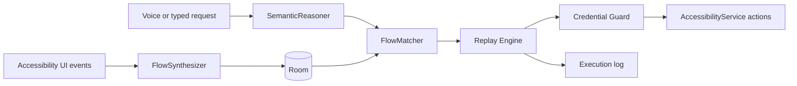

# SAAR architecture

## Teaching

The service begins a session after the user provides an instruction. Once the target package has emitted a window event, it records only interaction events from that package. UI nodes are classified while live into generic roles, then raw trace entries are deduplicated and converted to `FlowStep` records. Persisted steps contain a role, action, optional slot reference, and nearby role context—not a coordinate, resource ID, or target-app label.

Typed text in a search/text field becomes an `item` slot. Quantity and address controls become corresponding slots. The flow matcher resolves later values before replay. The `SemanticReasoner` interface allows a production embedding/LLM provider to replace the offline fallback without coupling that provider to the service or database.

## Replay and adaptation

The engine uses role lookup against the live accessibility tree for every step. It retries for a bounded six-second window and can dismiss a non-sensitive interruption when a generic dismiss affordance is available. Missing expected roles become a clarification rather than a coordinate guess. Every outcome is persisted for reporting.

The only cross-application control path is `AccessibilityService`: node actions are attempted first and a service gesture is used only as a fallback for the live resolved node. A normal launcher intent can bring a learned target app to foreground; it is not used to navigate or replace in-app taps.

## Credential boundary

`SensitiveScreenGuard` walks the full current tree before every step and stops on password/PIN input types, OTP fields, login signals, payment signals, or checkout actions. This is fail-closed: the service does not type, tap, or retain data on those screens.

## Target-app declaration

The generic implementation is intended to be demonstrated against Domino's and Zomato for food ordering, then Amazon for an e-commerce search/add-to-cart flow. It contains no selectors or code paths specific to any of these apps.
